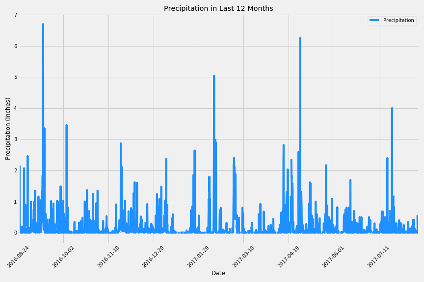

# Hawaii-Weather-SQLAlchemy

## Precipitation Analysis
* Design a query to retrieve the last 12 months of precipitation data.

* Select only the date and prcp values.

* Load the query results into a Pandas DataFrame.

* Sort the DataFrame values by date.

## Station Analysis

* Calculate the total number of stations.

* Find the most active stations.

* List the stations and observation counts.

## Daily Rainfall Average

* Calculate the rainfall per weather station using the previous year's matching dates.

* Calculate the daily normals.

# Create an APP

* Used Flask to create routes to present data (Jsonfify)

* Created a UI for users to input a start and end date into the url to obtain Average Temperature, and Min/Max Temperatures between the two dates.
